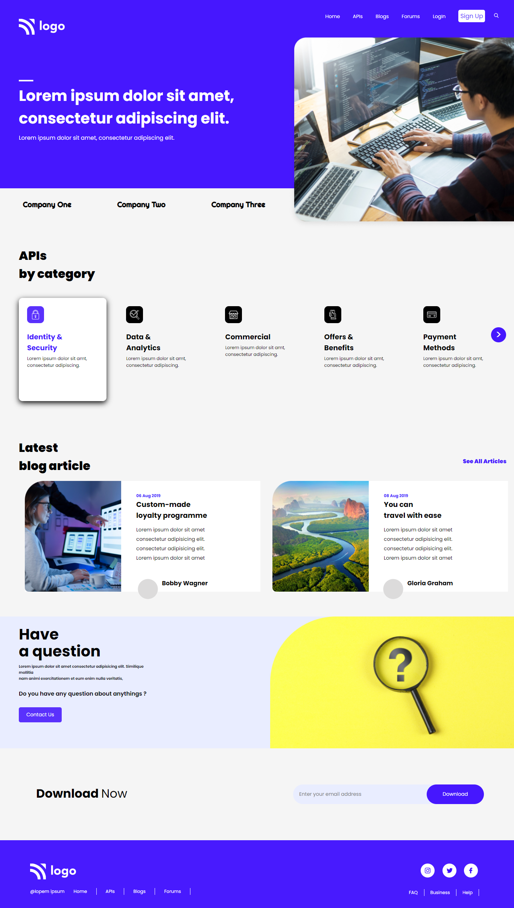

# Developer Landing Page

***
## Description

This project [Developer Landing Page]() was built using Semantic HTML and CSS. The main aim was to make the webpage responsive for all major devices.The difficulty was faced while making webpage responsive with **@media queries**. Making the webpage responsive was way time-consuming but I learnt alot. Also learnt about various flexbox properties and handling different sections on a webpage. The Project was completed under guidance of [Hitesh Choudhary](https://github.com/hiteshchoudhary), CTO Ineuron

***

### Links for Project

* [LIVE Project Link]()

* [Youtube Video Demo]()

* [Source Code]()

***
### Built With 

* Semantic HTML
* Custom CSS classes
* FlexBox
* Positions
* Media Queries

***

### Key Learnings

* Learned using [flexbox](https://developer.mozilla.org/en-US/docs/Web/CSS/flex)
* Learned to use positions(absolute & relative) for positioning different sections on webpage.
* Learned to handle various sections on same webpage.
* Learned to make webpage responsive with the help of [media queries](https://developer.mozilla.org/en-US/docs/Web/CSS/Media_Queries/Using_media_queries)

***

### Time Taken to finish this project
 

>4 hours to style the webpage and make it responsive also.

 

***

### Screencaptures of Project

 

  1. #### Whole Webpage

   

  

   

  2. #### Mobile View

 

 

  2. #### Tablet View 

   

  

   

  

  4. #### Large Screen View 

   

  

   

***

### Checkout Portfolio & Other Projects

#### [Personal Portfolio]()

#### [Findcoder Profile]()
***

### Connect with Me
* [Mailto](mailto:shubhambhoj3@gmail.com)
* [LinkedIn]()
* [Github]()
* [Findcoder]()
***
***
[go to top](#developer-landing-page)